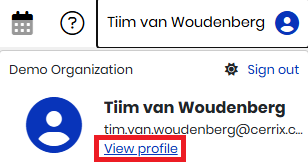

# API Key Management & Setup

This document explains how to generate and configure API keys for connecting external applications to the CERRIX APIs. The CERRIX API manuals describe available endpoints and payload formats. This guide focuses on the **steps required to securely create and manage API credentials**.

## **1. Create a New API Key**

1. Log in to CERRIX.
2. In the top right corner, click on your **name**.
3. Select **View profile**.\
   
4. In the left-hand menu, go to **API Keys**.
5. Click **Add** to create a new API key.\
   
6. Enter a descriptive **Name** for the API key.
7. The **expiration date** of an API key can be configured, but there is a maximum limit: it **cannot be set to longer than one year** from the date of creation. You can shorten this period if desired, but not extend it beyond the one-year maximum.

## **2. Configure Allowed IPs**

To improve security, API keys can be restricted to specific IP addresses.

1. Under **Allowed IPs**, click **Add**.
2. Enter the IP address of the server or system that will use this API key.
   * This should typically be the IP of the system where your integration or application will run.
   * For testing purposes, you may also use your own IP address. _(Confirm with your administrator which IP is appropriate.)_

## **3. Select Accessible APIs**

When creating an API key, you can define which APIs the key is authorized to call.

1. In the API key configuration screen, select the APIs you want this key to have access to.
2. Only the selected APIs can be accessed with this key. This allows you to follow the principle of least privilege.

## **4. Save and Retrieve the Credentials**

1. Click **Save** to create the API key.
2. Once saved, the system will generate:
   * **Identifier**
   * **Password**


**Important:** This is the **only time** these credentials will be displayed. For security reasons, they cannot be retrieved later.

* Copy the Identifier and Password immediately.
* Store them securely in your integration application or a secure password manager.

If you lose the credentials, you will need to generate a new API key.


## **5. Using the API Key**

Use the generated **Identifier** and **Password** to authenticate your requests as described in the [CERRIX API manuals](../api-documentation.md). Ensure that:

* The calling system’s IP matches one of the allowed IPs.
* The API key has been granted access to the endpoints you intend to call.
