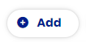
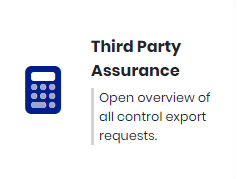

# External Connections

CERRIX enables secure, controlled sharing of control test information and evidence through the External Connections module. This feature is especially useful for auditors or third parties who require direct access to relevant control data and documentation.

## Steps to Set Up External Connection: <a href="#toc188544322" id="toc188544322"></a>

Navigate to the **Administration Controls** menu.

Click on **External Connections.**

<figure><figcaption></figcaption></figure>

Click on **Add.**



Fill in the following fields:

| Name                          | Enter a name for the external connection.                  |
| ----------------------------- | ---------------------------------------------------------- |
| Description (optional)        | Provide a brief description of the external connection.    |
| Assurance Employee (optional) | Select the person responsible for the external connection. |

Click **Next**

Provide the following details:

| Expiration Date | Specify the date until which the API can be accessed (maximum: 1 year from today).                                   |
| --------------- | -------------------------------------------------------------------------------------------------------------------- |
| IP Restriction  | Enter the IP address from which the API can be accessed. Only API requests from these IP addresses will be accepted. |

Click **Next**

Select the controls that can be queried through the API.

<figure><figcaption></figcaption></figure>

Click **Next**

From the dropdown menu, select **Effectiveness** under **Testplan type**.

Specify the Start Date and End Date for the testplans from the controls that may be queried through the API.

Click **Next**

Click **Complete**

Your API key and secret are now displayed on the screen. Ensure you store them securely, as they won't be shown again.

<figure><figcaption></figcaption></figure>

## Requesting data through the API calls <a href="#toc188544323" id="toc188544323"></a>

Use your new API credentials to export control data. You can use any API tool (e.g., Postman) or your terminal. In the example below, we will use Postman.

### Request the Export <a href="#toc188544324" id="toc188544324"></a>

Steps to Set Up ControlTestInformation:

* **Open Postman:** Start the Postman application on your computer.
* **Create a New Request:**

Click on the '+' icon or 'Create a request' to create a new request tab.

* **Set the HTTP Method:**

From the dropdown menu next to the URL input bar, select the **POST** method.

* **Enter the URL:**

Input the Base URL followed by the Routing path.

The Base URL is always composed of the environment URL followed by "/api,"


For routing to Control Test Information, please use the following path:\


Fill in the URL as:

`https://<your-environment>.cerrix.com/api/thirdpartyassurance/requestexport`<br>

* **Add the following query Params:**

| Key                 | Value                                                                                                                            |
| ------------------- | -------------------------------------------------------------------------------------------------------------------------------- |
| controlids          | <p>Enter the control ID in format “00000001”. </p><p>Add multiple controls by adding a semicolon ";" between the control IDs</p> |
| testplantypes       | Enter “Effectiveness”                                                                                                            |
| testplanperiodstart | Enter the Start Date from the Period in format “2022-01-01”                                                                      |
| testplanperiodend   | Enter the End Date from the Period in format “2022-12-31”                                                                        |

* **Set up the Authorization.**
  * Select the “Basic Auth” type.
  * Fill in the API key and secret as provided in the earlier step.

<figure><figcaption></figcaption></figure>

1. Press "Send"
2. A Request ID will be retrieved from the API call. Save this Request ID.

### Retrieve the Export Results <a href="#toc188544325" id="toc188544325"></a>

* **Create a New Request:**

Click on the '+' icon or 'Create a request' to create a new request tab.

* **Set the HTTP Method:**

From the dropdown menu next to the URL input bar, select the **GET** method.

* **Enter the URL:**

Input the Base URL followed by the Routing path.

The Base URL is always composed of the environment URL followed by "/api,"


For routing to Get Result, please use the following path:\


Fill in the URL as:

`https://<your-environment>.cerrix.com/api/thirdpartyassurance/getresults/<requestId>`<br>

1. Fill in the 'requestId' field with the Request ID received through the previous API call.
2. Set up the Authorization.
   1. Select the “Basic Auth” type.
   2. Fill in the API key and secret as provided in the earlier step.
3. Press "Send"
4. The API will respond with a JSON file.

Here's a sample response containing all information related to the control:

```json
{
    "Status": "Data is ready",
    "Controls": [
        {
            "ControlIdentifier": "00000106",
            "ControlName": "User Acceptance Testing",
            "ControlDescription": "After the software change has been made based on the approved functional design, it is subject to a User Acceptance Testing process.",
            "ControlFrequency": "On Event",
            "KeyControl": true,
            "RequiresMonitoring": true,
            "ControlExecution": "Manual execution",
            "AspectIC": "Process controls",
            "MitigatedRisks": "Business Disruption due to implemented changes that are unsupported by ADHB requirements;Data in component banker can be filled in incorrectly",
            "RelatedOrganization": "Demo Organization\\Group Mortgages\\Operating companies\\Mortgages The Netherlands\\CFRO\\IT",
            "RelatedBusinessDimensions": [
                "Processes\\Supporting processes\\IT\\5 Regular Change Management"
            ],
            "RelatedFrameworkDimensions": [],
            "TestPeriods": [
                {
                    "TestPeriodName": "2024",
                    "TestPeriodScore": null,
                    "TestPeriodStartDate": "2024-01-01T00:00:00Z",
                    "TestPeriodEndDate": "2024-12-31T00:00:00Z",
                    "TestPlans": [
                        {
                            "TestPlanName": "2024",
                            "TestPlanStatus": "Waiting for evidence",
                            "TestPlanStartDate": "2024-01-01T00:00:00Z",
                            "TestPlanEndDate": "2024-12-31T00:00:00Z",
                            "SampleMethod": "One sample",
                            "ReasonForManualGeneration": "",
                            "SampleType": "Default",
                            "TestSample": 0,
                            "TestPopulation": 0,
                            "SourceDocumentUploader": "",
                            "DueDateSourceDocumentUploader": "0001-01-01T00:00:00Z",
                            "EvidenceUploaders": [
                                "Doe, John"
                            ],
                            "DueDateEvidenceUploader": "2025-01-01T00:00:00Z",
                            "Testers": [
                                "Doe, John"
                            ],
                            "DueDateTester": "2025-01-01T00:00:00Z",
                            "Reviewers": [
                                "Stas, Dart"
                            ],
                            "DueDateReviewer": "2025-01-01T00:00:00Z",
                            "LinkedStandard": "ISAE3402",
                            "QualityAspects": "Accuracy;Completeness;In Time",
                            "TestNorm": "",
                            "TestedBy": null,
                            "OverallScoreTester": null,
                            "CommentTester": null,
                            "DateTesterTested": "0001-01-01T00:00:00Z",
                            "ReviewedBy": null,
                            "OverallScoreReviewer": null,
                            "CommentReviewer": null,
                            "DateReviewerTested": "0001-01-01T00:00:00Z",
                            "TestSamples": [],
                            "SourceDocuments": []
                        }
                    ]
                }
            ]
        }
    ]
}
```

### Request the export for Get Evidence Document <a href="#toc188544326" id="toc188544326"></a>

* **Create a New Request:**

Click on the '+' icon or 'Create a request' to create a new request tab.

* **Set the HTTP Method:**

From the dropdown menu next to the URL input bar, select the GET method.

* **Enter the URL:**

Input the Base URL followed by the Routing path.

The Base URL is always composed of the environment URL followed by "/api,"


For routing to Get Evidence Document, please use the following path:\


Fill in the URL as:

`https://<your-environment>.cerrix.com/api/thirdpartyassurance/getevidencedocument/<requestId>`

* **Add the following query Params:**

| Key               | Value                                                                                                                                                                               |
| ----------------- | ----------------------------------------------------------------------------------------------------------------------------------------------------------------------------------- |
| controlidentifier | Enter the control ID in format “00000001”                                                                                                                                           |
| documentid        | Locate the Document ID within the JSON file received with the Export Results API call. This ID can be found within the SourceDocuments, SampleDocuments, or StepDocuments sections. |

* Fill in the 'requestId' field with the Request ID received in the first API call.
* Set up the Authorization.
  * Select the “Basic Auth” type.
  * Fill in the API key and secret as provided in the earlier step.
* Press "Send"
* The document will be received as a binary stream from the API.

### Logging <a href="#toc188544327" id="toc188544327"></a>

CERRIX logs all API calls made for external connections. This ensures users always have an overview of the requested APIs and their respective timestamps. Furthermore, it provides insight into the specific controls that were requested.

* Navigate to the **Administration Controls** menu.
* Click on **Third Party Assurance.**

On this page you can find an overview of all Third Party Assurance connections.&#x20;

<figure><figcaption></figcaption></figure>

For each connection, you can access a log of which controls were accessed.

<figure><figcaption></figcaption></figure>
