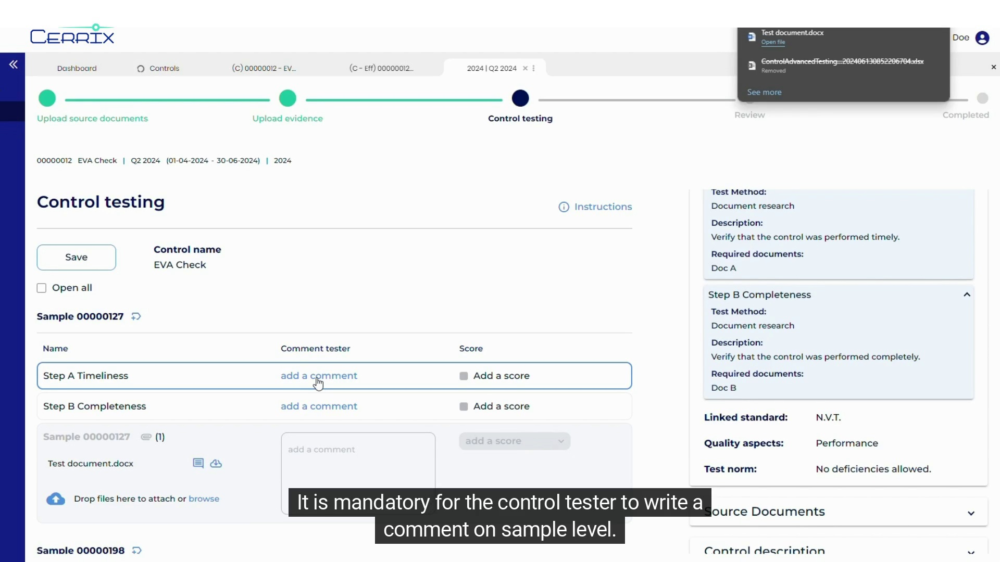
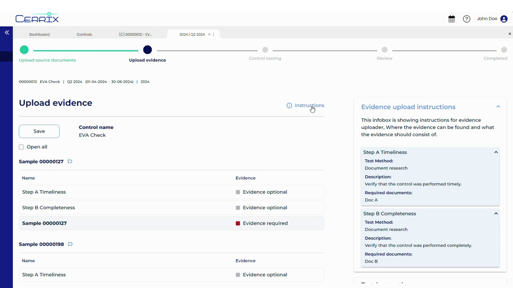

# Control advanced effectiveness testing

<figure><figcaption></figcaption></figure>

Control Effectiveness Testing ensures that controls are functioning as intended to mitigate risks. This process involves multiple steps to validate design and operational effectiveness.

### Steps for Effectiveness Testing

#### Step 1: Source Document Upload

1. Navigate to the test plan in the **Controls** module.
2. Click **Upload Source Document**.
3. Drag and drop files or browse to upload relevant documents.
4. Optionally, add a description for the uploaded file.

#### Step 2: Generating Samples

* Choose a sampling method:
  * **By Number**: Generate samples based on a predefined count.
  * **By Date**: Use a date range to generate samples.
  * **By Spreadsheet**: Upload a spreadsheet and configure sample generation.

#### Step 3: Uploading Evidence

<figure><figcaption></figcaption></figure>

* Upload evidence for each sample.
* Mark samples without evidence and provide a reason in the comments.

#### Step 4: Testing

* Assess each sample and document findings.
* Provide scores and comments for each test step.

#### Step 5: Reviewer Step

* The reviewer assesses the results, provides feedback, and confirms the final outcome.

> **Best Practice**: Ensure all required documents are uploaded before moving to the next step.

***

For detailed workflows, see the [Controls Module Guide](controls/).
