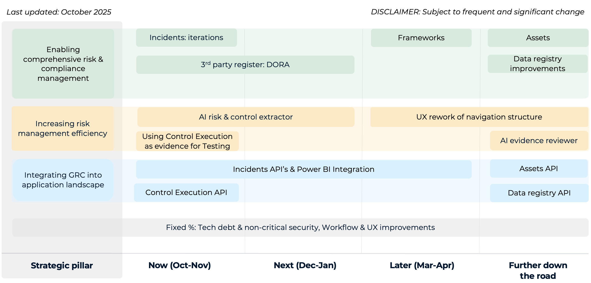

# Service Level Agreement (SLA)

## Introduction 

This Service Level Agreement ("SLA") sets forth the terms and conditions under which CERRIX ("Service Provider") commits to deliver its Governance, Risk Management, Compliance, and Audit Management ("GRCA") SaaS platform ("the Service") to its customers ("Customer"). This SLA is an integral part of the agreement between the Service Provider and the Customer, ensuring clarity, accountability, and a shared understanding of service expectations.

### Purpose 

The purpose of this SLA is to define the levels of service the Customer can expect from the Service Provider, including performance metrics, support availability, and issue resolution timelines. It establishes the foundation for a productive partnership aimed at supporting the Customer’s operational and strategic goals in governance, risk management, compliance, and audit management.

### Scope 

This SLA applies exclusively to the GRCA SaaS platform hosted on Microsoft Azure. It outlines the responsibilities of the Service Provider in ensuring platform availability, reliability, security, and performance, as well as the responsibilities of the Customer in adhering to usage guidelines and reporting issues.

### Out of scope 

This SLA does not cover:

* Issues caused by factors outside the Service Provider’s control, such as Customer misuse, third-party integrations, or natural disasters.
* Downtime during scheduled maintenance periods, provided the Customer is notified in advance.
* Beta features or experimental functionalities not explicitly covered under this SLA.

### Objectives 

The primary objectives of this SLA are to:

1. Define service availability, reliability, and performance standards.
2. Specify support response and resolution times for various issue severities.
3. Promote a collaborative approach to continuous service improvement.

## Service Levels 

### Service Window 

1. The Platform shall be available to the Customer **24 hours a day, 7 days a week, 365 days a year**, excluding periods of scheduled maintenance as described below.

### Maintenance window 

The Service Provider is responsible for all changes, updates and maintenance to the Platform In this respect, the Service Provider:

1. may at its discretion make changes or and updates to the Platform or application such as Infrastructure, Security and/or Functionality.
2. Inform the customer at least 48 hours prior to the start of scheduled maintenance.
3. Shall plan the maintenance outside business hours.
4. May, for corrective and preventive maintenance, execute unscheduled maintenance. The Service Provider will take all reasonable steps to inform the customer of unscheduled maintenance.

### Support Window 

1. The customer is entitled to functional support during business hours, being Monday till Friday from 09:00 till 17:00, excluding National holidays in The Netherlands.
2. New support tickets are to be created by the customer in the customer support portal of the Service Provider: [https://support.cerrix.com](https://support.cerrix.com/).

### Ticket types & Priorities 

The Service Provider will classify all tickets and assign one of the following ticket types to the customers ticket:

1. Service Request
2. Incident
3. Bug
4. Change Request
5. Feature Request

During the classification process, Incidents and Bugs receive a priority:

1. The Priority is based on the Impact and the Urgency of the ticket.
2. The priority is based on the Service Provider classification, supported by the priority matrix below:

<figure><figcaption></figcaption></figure>

| Category | High                                        | Medium                                                                                                                        | Low                                                                       |
| -------- | ------------------------------------------- | ----------------------------------------------------------------------------------------------------------------------------- | ------------------------------------------------------------------------- |
| Impact   | The entire application is down or unusable. | One or more modules of the application are unusable or crucial functionality does not work. No approved workaround available. | Non crucial functionality does not work. Approved work around available.  |
| Urgency  | Resolution time is of the highest urgency.  | Some flexibility with regards to the resolution time.                                                                         | Can be solved later because there is no immediate impact on the Customer. |

### Response & Resolution Times 

### Availability 

1. The Service Provider shall make all reasonable efforts to ensure that the production platform of its GRCA system is **available 99,5% per month**.
2. The Acceptation environment is excluded from this Service Level and will be supported best effort.
3. Schedule Maintenance is excluded from this Service Level and therefore not calculated as downtime (unavailability).
4. In case of downtime, a Recovery Point Objective of 1 hour is applicable and a Recovery Time Objective of 8 hours.

### Software Updates 

1. The Service Provider shall regularly update the SaaS Platform to improve functionality, security, and performance. Updates may include bug fixes, security patches, performance enhancements, and new features.
2. The Provider shall carry out software updates during scheduled maintenance windows.
3. In cases where emergency maintenance is required, the Provider reserves the right to apply hotfixes immediately without prior notice. The Provider will make reasonable efforts to notify the Customer as soon as possible in such events.
4. The Service Provider will take all reasonable effort to ensure that updates do not disrupt functionality and/or use of the application.
5. When a Critical bug disrupts the functionality of the system, a hotfix will be applied by the Service Provider.

## Service Improvement 

When CERRIX does not meet the Service Levels for Availability or Incident Resolution Times for three consecutive months, we commit to a Service Improvement Program. The Service Improvement program is a documented program containing:

* Objectives & Scope
* A Root Cause Analysis
* Improvement Actions and Timelines
* Continuous Monitoring and feedback
* Accountability & Governance

The documented Service Improvement Program will be shared with affected customers.

## Glossary of Terms 

| Term                         | Description                                                                                                                                    |
| ---------------------------- | ---------------------------------------------------------------------------------------------------------------------------------------------- |
| **Availability**             | The proportion of total time that the application is fully functional and accessible to end users, excluding periods of scheduled maintenance. |
| **Bug**                      | An error, flaw, or unintended behavior in a software application that causes it to produce incorrect or unexpected results.                    |
| **Hot fix**                  | A quick and targeted software update released to fix a critical bug or security vulnerability.                                                 |
| **Incident**                 | An unplanned event or disruption that affects the normal operation of a system or service.                                                     |
| **Maintenance Window**       | A scheduled period during which system updates, patches, or upgrades are performed.                                                            |
| **Recovery Point Objective** | The measure of the time a service is accessible and operational for use by customers                                                           |
| **Recovery Time Objective**  | The maximum acceptable amount of data loss measured in time before a disaster affects the service3                                             |
| **Resolution Time**          | The total time taken to fully resolve an issue or incident, from initial detection to the implementation of a permanent fix.                   |
| **Response Time**            | The time taken to acknowledge and begin addressing an issue, request, or incident after it has been reported.                                  |
| **Service Level**            | The target time set for the recovery of IT and business activities after a disaster has occurred                                               |
| **Service Level Agreement**  | he specific performance standards or service quality metrics agreed upon in a Service Level Agreement                                          |
| **Service Level Report**     | A document that provides details on the performance of a service against the agreed Service Levels6                                            |
| **Service Window**           | The predefined time period during which a system, application, or service is expected to be operational and available to users.                |
| **Uptime**                   | The percentage of time a system, service, or application is operational and available, measured over a month.                                  |
