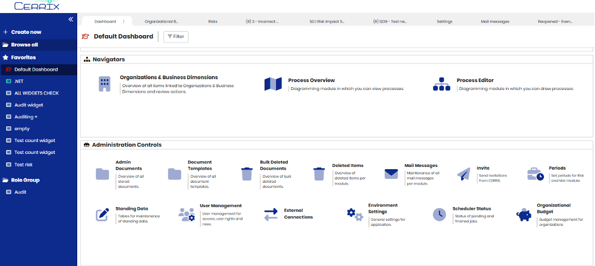

# SLA Dashboard

<figure><figcaption></figcaption></figure>

The SLA Dashboard provides customers with real-time insights into support performance and platform availability. It is designed to help you monitor ticket trends, track SLA adherence, and review uptime metrics relevant to your organization.

This article explains how to access the SLA Dashboard, what information it contains, and how to interpret the widgets.

***

## Accessing the SLA Dashboard

You can access the SLA Dashboard through the CERRIX Support Portal

* Log in to the [CERRIX Support Portal](https://support.cerrix.com/portal/).
* Navigate to Dashboards → SLA Dashboard (individual customer).


Access to the SLA Dashboard is restricted to authorized customer contacts. If you believe you should have access but do not see the dashboard, please contact your CERRIX account administrator.


***

## Filtering Options

The SLA Dashboard includes a date range filter:

* Default setting: Last quarter (3 months).
* Filter behavior: The filter applies to the _ticket creation date_. Only tickets created within the selected date range are shown in the widgets.

***

## Dashboard Widgets

The SLA Dashboard is organized into several widgets, each focused on a specific area of support and availability:

### Ticket Trend

* Purpose: Provides an overview of how many tickets were opened and closed by your team.
* Granularity: Displayed per month within the selected date range.

### Tickets per Type

* Purpose: Shows the breakdown of tickets created by type (e.g., incident, bug, change request).


You can review the definitions of the different ticket types in the [.](./ "mention").


### Response and Resolution Times

* Purpose: Shows how your support tickets performed against agreed service levels for response and resolution, separated per ticket type.
* Definitions:
  * Response SLA Met (%): Percentage of tickets that received an initial response within the defined SLA timeframe.
  * Resolution SLA Met (%): Percentage of tickets resolved within the SLA timeframe.
  * Total Tickets: Total number of tickets created in the selected date range.
  * Unresolved Tickets: Tickets still open at the time of reporting. These are excluded from SLA target calculations.


You can review the SLA timeframes in the [.](./ "mention").


### Uptime

* Purpose: Displays the measured uptime percentage of your CERRIX environment.
* Method: Based on automated checks that validate the basic availability of your environment.
* Important to note:
  * Scheduled maintenance is not filtered out.
  * False negatives may occur due to limitations in the automated check (e.g., temporary network hiccups).
  * As a result, the reported uptime percentage is typically slightly lower than actual availability.


You can review the definitions of uptime in the [.](./ "mention").


### Further Information

* Purpose: Provides context for availability metrics.
* Contents:
  * Overview of recent releases.
  * Summary of incidents that may have impacted platform availability.

***

## SLA Dashboard Data

* Data Source: The SLA Dashboard pulls directly from the CERRIX support and monitoring systems.
* Refresh Rate: Data is updated in real time.
* Only use data from July 1st 2025 onwards as a source, as only to these tickets the correct SLA's have been applied.

***

## Exporting & Reporting

Currently, the SLA Dashboard does not provide an export-to-Excel or PDF export function. For periodic reporting we recommend taking a screenshot of the dashboard.
